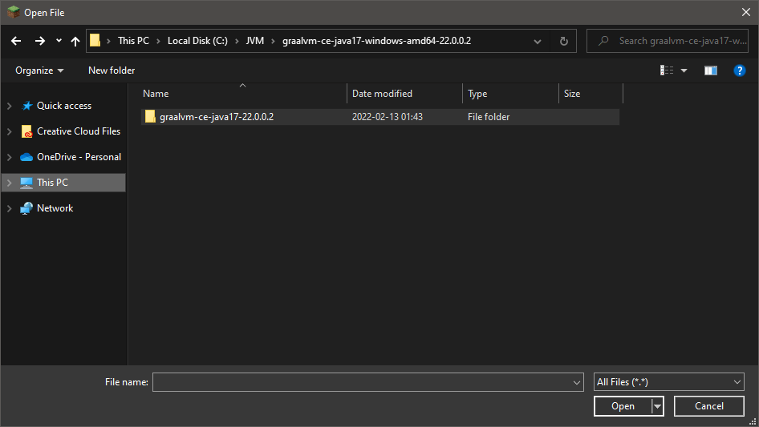

# A tutorial for using GraalVM with Minecraft: Java Edition

It's weird that there's not already a tutorial for this, so I'm making this one.

## Preface: Why?

Minecraft uses a **J**ava **V**irtual **M**achine (JVM) to run it's source code on your computer.

By default, Minecraft comes packaged with the *OpenJDK* JVM, which is the most commonly used JVM, and has been tested to work with Minecraft.

GraalVM is a relatively new JVM which focuses on *performance*, where OpenJDK JVM falls behind. With all of it's new optimizations turned on, it performs [considerably better than all currently available JVMs, according to Fine Constant's testing.](https://www.fineconstant.com/posts/comparing-jvm-performance/)

So, if you would like to try it out, here's how:

## Step 1: Determine the version of Java your Minecraft version uses!

| Minecraft Version | Java Version | GraalVM Version |
|-|-|-|
|21w19a - 1.18.0 and newer|Java 17 or newer|[GraalVM 22.0.0.2](https://github.com/graalvm/graalvm-ce-builds/releases/tag/vm-22.0.0.2)
|1.6 or older|Java 8|[GraalVM 21.3.1](https://github.com/graalvm/graalvm-ce-builds/releases/tag/vm-21.3.1)

## Step 2: Find the right GraalVM archive for you!

Open the GraalVM link in the table above for your Minecraft version. You should see a GitHub Releases page, like such: 


You'll want to scroll down to `Assets`, and click on it to open the list of all of the released executables for this version of GraalVM.

This will open a very big list, but don't be intimidated!


The file we want will always start with `graalvm-ce-java`, so scroll down until you see that! For this version of GraalVM, it starts right after `espresso-llvm-installable-ce-java17-linux-amd64-22.0.0.2.jar.sha256`;


Now, you should find the GraalVM file that matches the Java version you need for Minecraft, and the operating system you are running. I'm modding 1.18.1 and I'm on Windows, so that means I need to find `graalvm-ce-java17-windows`- it's just a little further down!


In this case, `graalvm-ce-java17-windows-amd64-22.0.0.2.zip` looks like the thing I need! If you were on Mac OS X, you would want `graalvm-ce-java17-darwin-amd64-22.0.0.2.tar.gz`! The last version number will change depending on what Java version you need- for instance, my system would need `graalvm-ce-java8-windows-amd64-21.3.1.zip` from the link above.

### Be careful to download the `.zip` or `.tar.gz`, **NOT** the `.zip.sha256` or `.tar.gz.sha256`!

# Step 3: Download it!

Now that we know we need to download `graalvm-ce-java17-windows-amd64-22.0.0.2.zip`- we just click on it!


This fairly large zip file (335MB!) contains the entire JVM needed to run Minecraft, with all of it's supporting libraries and executables- in other words, when we extract this zip file, wherever we put the extracted files will be what we need to tell Minecraft to use. 

Personally, I'm going to make a new directory called `JVM` in my `C:` drive (`C:\JVM`), and download the zip to there.


Now, just need to extract it.


# Step 4: Configure Minecraft!

So, we have GraalVM downloaded to somewhere we can remember. The only thing left to do is configure Minecraft to use it!

The way you tell Minecraft to use GraalVM depends on the Launcher you are using, so below are different sections for the main launchers I could think of.

## [CurseForge](https://download.curseforge.com/)

Unfortunately, CurseForge doesn't actually allow setting the Java version Minecraft will use directly. Instead, *each time you launch a modpack*, you will have to follow the instructions below for the Official Launcher, as CurseForge will reset the Official Launcher's settings each time you launch a modpack using it.

If this annoys you, I would recommend looking into [MultiMC](https://multimc.org/)- this problem is exactly why I switched!

## [Offical Launcher](https://minecraft.net/download)

### Step 1: Go to `Installations`!


### Step 2: Hover over the installation you want to modify, and click on the three dots, then click `Edit`!


### Step 3: Click on `More Options`!


### Step 4: Click `Browse` under `Java Executable`!


This will open a file browser- we want to go back to where we extracted GraalVM now!



Now, inside here, we're going to navigate into however many folders it takes, until we get here:


We want to go inside `bin`, and scrooooooooll on down until you find `javaw.exe`.


Click on it, click `Open`, and you'll see in the Minecraft launcher that it has taken the place of `<Use bundled Java runtime>`.


### Step 5: JVM Arguments
Use the JVM arguments from step 4 below in the `JVM Arguments` field.


## [MultiMC](https://multimc.org/)

MultiMC makes this really easy.

### Step 1: Go to `Settings`, `Java`, and click on the three dots next to `Java path`.


### Step 2: Set it to the GraalVM executable
This will open a file browser- we want to go back to where we extracted GraalVM now!


Now, inside here, we're going to navigate into however many folders it takes, until we get here:


We want to go inside `bin`, and scrooooooooll on down until you find `javaw.exe`.


Click on it, and click `Open`.

### Step 3: JVM Arguments
Use the JVM arguments from step 4 below in the `JVM Arguments` field!

# Step 4: Set JVM Arguments
Now, we want to set up the JVM arguments to do the following:
|Flag|Explanation|
|-|-|
|`-XX:+UnlockExperimentalVMOptions`|Enable experimental JVM options, such as the JIT and optimized GC|
|`-XX:+UseJVMCICompiler`|Enable the JIT|
|`-XX:+UseG1GC`|Enable the experimental optimized garbage collector|
|`-XX:G1NewSizePercent=20`|Set the lower bound of the GC|
|`-XX:G1MaxNewSizePercent=60`|Set the upper bound of the GC|
|`-XX:G1ReservePercent=20`|Set the reserved space for the GC|
|`-XX:MaxGCPauseMillis=50`|Ask the GC to not pause our program for more than 50ms at a time- this hugely helps with stutters!|
|`-XX:G1HeapRegionSize=32M`|Optimize the heap region size|
|`-Xms2G`|Allocate at least 2 gigabytes of memory to minecraft|
|`-Xmx10G`|In this example, we allow minecraft to consume up to 10 gigabytes of memory. This is the one flag you should probably adjust for your modpack/system, so that's why it's at the end!|

In summary, you should paste this into the `JVM Argments` field:

```
-XX:+UnlockExperimentalVMOptions -XX:+UseJVMCICompiler -XX:+UseG1GC -XX:G1NewSizePercent=20 -XX:G1MaxNewSizePercent=60 -XX:G1ReservePercent=20 -XX:MaxGCPauseMillis=50 -XX:G1HeapRegionSize=32M -Xms2G -Xmx10G
```

# Step 5: Verify Minecraft is using GraalVM. 

We want to make absolutely sure Minecraft is actually using GraalVM- the way we do this is just by looking in the Minecraft log.

## For MultiMC:
When you launch the game, you will automatically have the log opened- scroll up, until you find this line:


If this was not running GraalVM, it would not show `from GraalVM Community` here.

## For any launcher:
The official launcher and others may not show this message at all. In this case, the easiest way to ensure GraalVM is being used is to just start the game, and open the task manager to inspect the details of what's running:


We can see here that `C:\JVM\graalvm[...]` is running it!

# Step 6: Enjoy :)